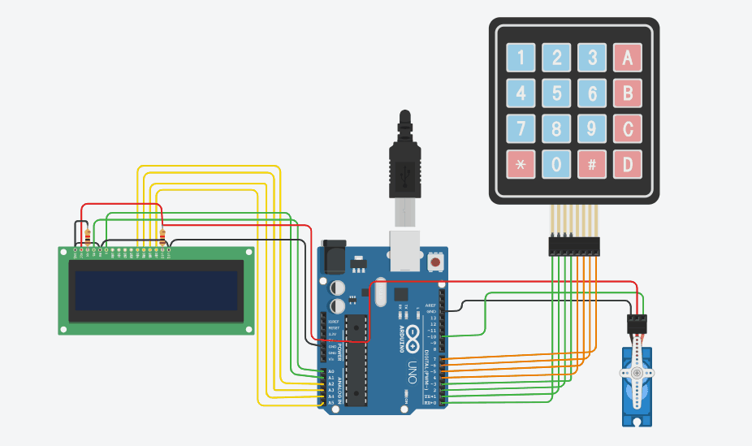
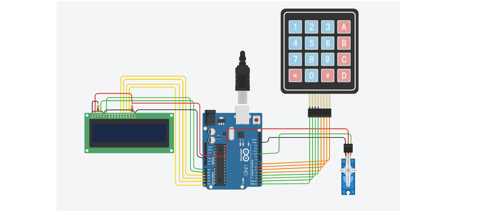

# Automatic Door Lock System 🔐

I built this password-based door lock using Arduino UNO for my embedded systems practice. The whole circuit was designed and tested in Tinkercad Circuits.

### Demo

### How it works
1. LCD shows "Enter Password" when system starts
2. I enter password using 4x4 keypad 
3. If I type `D2005` → servo motor turns and door unlocks
4. If wrong password → LCD shows "Incorrect Password"
5. After 2 seconds it resets to enter password again

### Components I used
- Arduino UNO
- 16x2 LCD Display
- 4x4 Keypad  
- SG90 Servo Motor
- Few jumper wires

### Software & Libraries
- Arduino IDE
- Tinkercad Circuits for simulation
- Used `Servo.h`, `Keypad.h`, `LiquidCrystal.h` libraries

### Files
- `DoorLock.ino` - My Arduino code
- `demo.gif` - Video of working project
- `circuit-diagram.png` - Circuit connections

### What I learned
- Interfacing keypad and LCD with Arduino
- Controlling servo motor based on conditions
- Writing password authentication logic in Embedded C

### Future improvements I want to add
- Store password in EEPROM so it doesn't reset
- Add buzzer for wrong password attempts
- Try connecting Bluetooth module.

### **Circuit Diagram**

